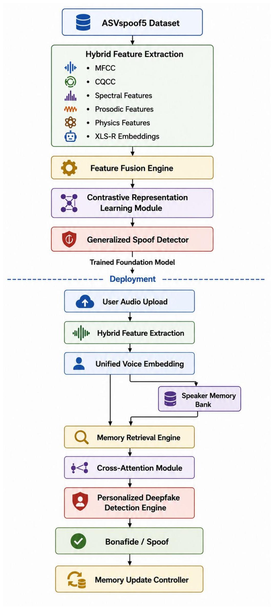
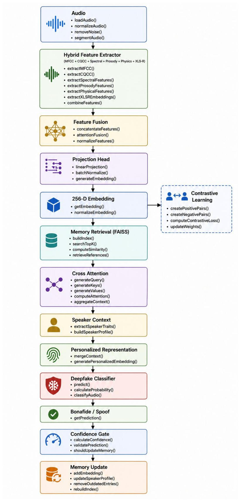

<div align="center">

# 🎙️ Memory-Augmented Deepfake Audio Detection

### Hybrid acoustic features, XLS-R representations, speaker-aware contrastive learning, and adaptive user memory

[](https://www.python.org/)
[](https://pytorch.org/)
[](https://huggingface.co/docs/transformers/)
[](https://www.asvspoof.org/)
[](#project-status)

Detects spoofed speech at two levels: **general audio authenticity** and
**personalized speaker consistency**.

[Overview](#overview) · [Architecture](#architecture) · [Quick Start](#quick-start) ·
[Pipeline](#implementation-pipeline) · [Outputs](#evaluation-outputs) · [Usage](#personalized-inference)

</div>

---

## Overview

Most deepfake audio detectors remain fixed after training. This project explores a
different approach: begin with a general anti-spoofing model, then safely adapt to
each user through a memory bank of trusted voice embeddings.

The system combines:

- **Cepstral features:** MFCC and LFCC sequences
- **Spectral features:** centroid, bandwidth, roll-off, contrast, flatness,
  chroma, RMS energy, and zero-crossing rate
- **Prosodic features:** pitch, voiced ratio, silence distribution, energy, and
  pitch variation
- **Physics-guided features:** formants, harmonic-to-noise ratio, jitter, and
  shimmer
- **Learned speech representations:** XLS-R embeddings
- **Speaker-aware learning:** genuine-speaker contrastive loss
- **Personalization:** similarity retrieval, learned memory attention, confidence
  gating, and controlled memory updates

> [!NOTE]
> This repository is intentionally limited to the **ASVspoof2019 LA** training,
> personalization, calibration, and held-out evaluation workflow. Cross-dataset
> ASVspoof2021 experiments live in a separate repository.

## Architecture

<p align="center">
  
</p>

<details>
<summary><strong>View the low-level pipeline</strong></summary>
<br>
<p align="center">
  
</p>
</details>

## How it works

1. Audio is loaded, resampled to **16 kHz**, normalized, and converted to a fixed
   **4-second** segment.
2. Handcrafted and XLS-R features are extracted from the same signal.
3. Gated fusion learns how much importance to assign to each feature branch.
4. The general detector predicts **bonafide** or **spoof**.
5. Speaker-aware contrastive learning creates a normalized voice embedding.
6. For a known user, the model retrieves trusted embeddings from that user's
   memory.
7. Learned attention combines the current sample with the retrieved speaker
   context.
8. A calibrated confidence gate decides the final label and whether the new
   embedding is safe to store.

## Repository structure

```text
deepfakeAudio/
├── high-level-architecture.jpg
├── low-level-architecture.jpg
├── src/
│   ├── audio.py                # Loading, normalization, and segmentation
│   ├── features.py             # Acoustic, prosodic, spectral, physics features
│   ├── xlsr.py                 # XLS-R feature extraction
│   ├── fusion.py               # Feature bundle construction
│   ├── model_phase2.py         # General SE-enhanced detector
│   ├── model_phase3.py         # Speaker-aware contrastive model
│   ├── memory_phase4.py        # Per-user embedding memory
│   ├── model_phase5.py         # Learned memory-attention module
│   ├── online_detector_phase6.py
│   └── evaluate_phase7.py      # Paper-ready evaluation and plots
├── smoke_test*.py              # Phase-level sanity checks
└── requirements.txt
```

## Quick start

### 1. Clone the repository

```bash
git clone https://github.com/suhaniibalchandanii/deepfakeAudio.git
cd deepfakeAudio
```

### 2. Create an environment

```bash
python3 -m venv .venv
source .venv/bin/activate
python -m pip install --upgrade pip
pip install -r requirements.txt
```

On Windows, activate with:

```powershell
.venv\Scripts\activate
```

The code automatically selects **CUDA**, **Apple MPS**, or **CPU**, in that
order of availability.

### 3. Prepare ASVspoof2019 LA

Arrange the dataset as follows:

```text
data/ASVspoof2019/LA/
├── ASVspoof2019_LA_cm_protocols/
├── ASVspoof2019_LA_train/flac/
├── ASVspoof2019_LA_dev/flac/
└── ASVspoof2019_LA_eval/flac/
```

Alternatively, point the project to an external dataset directory:

```bash
export ASVSPOOF_LA_ROOT="/absolute/path/to/ASVspoof2019/LA"
```

## Implementation pipeline

The repository is organized as seven reproducible phases.

| Phase | Purpose | Main command |
|:---:|---|---|
| 1 | Preprocess audio and cache hybrid features | `python -m src.extract_phase1 --split train --with-xlsr` |
| 2 | Train the general deepfake detector | `python -m src.train_phase2` |
| 3 | Add speaker-aware contrastive learning | `python -m src.train_phase3` |
| 4 | Introduce personalized user memory | `python smoke_test_phase4.py` |
| 5 | Train learned memory attention | `python -m src.cache_phase5_embeddings --split train` |
| 6 | Calibrate confidence gates and online inference | `python -m src.calibrate_phase6` |
| 7 | Produce held-out, paper-ready evaluation | `python -m src.evaluate_phase7 --split eval` |

For Phase 5, cache the `train`, `dev`, and required evaluation embeddings before
running:

```bash
python -m src.cache_phase5_embeddings --split train
python -m src.cache_phase5_embeddings --split dev
python -m src.train_phase5
```

Run lightweight sanity checks before full training:

```bash
python smoke_test.py
python smoke_test_phase2.py
python smoke_test_phase3.py
python smoke_test_phase4.py
python smoke_test_phase5.py
python smoke_test_phase7.py
```

## Personalized inference

After Phases 2, 3, 5, and 6 have produced their checkpoints and calibration file:

```bash
python -m src.infer_phase6 \
  --user-id "demo-user" \
  --audio "/path/to/sample.wav"
```

To classify without updating the user's memory:

```bash
python -m src.infer_phase6 \
  --user-id "demo-user" \
  --audio "/path/to/sample.wav" \
  --no-update
```

The JSON response includes:

```json
{
  "mode": "learned_personalized_verification",
  "general_bonafide_probability": "...",
  "general_spoof_probability": "...",
  "personalized_bonafide_probability": "...",
  "personalized_spoof_probability": "...",
  "speaker_similarity": "...",
  "decision": "bonafide_verified | spoof_or_mismatch",
  "memory_updated": "true | false"
}
```

The first sufficiently trusted bonafide sample can initialize a user's memory.
Later samples are admitted only when the calibrated general, personalized, and
speaker-similarity conditions are satisfied.

## Evaluation outputs

Phase 7 writes publication-oriented artifacts to `outputs/phase7/<split>/`:

| Output | Description |
|---|---|
| `metrics.json` | Dataset, thresholds, metrics, and paired-bootstrap results |
| `paper_metrics.csv` | Accuracy, precision, recall, macro-F1, ROC-AUC, and EER |
| `predictions.csv` | Per-sample general, personalized, and deployment decisions |
| `confusion_matrices.png` | Side-by-side model error comparison |
| `roc_curves.png` | General versus personalized ROC curves |
| `reference_ablation.png` | Effect of using 1, 2, 4, or 8 memory references |
| `reference_ablation.csv` | Numerical values behind the ablation plot |

<p align="center">
  
</p>

> [!IMPORTANT]
> Evaluation figures and metric values are generated locally from the user's
> dataset and trained checkpoints. They are intentionally not fabricated or
> hard-coded in this README.

## Research evaluation

The evaluation code compares three operating modes:

- **General:** dataset-trained anti-spoofing prediction
- **Personalized:** learned memory-attention prediction
- **Deployment-gated:** calibrated decision policy for online use

Reported measures include accuracy, macro precision/recall/F1, ROC-AUC, equal
error rate (EER), confusion matrices, reference-count ablation, and paired
bootstrap confidence intervals. A personalization improvement should be claimed
only when its paired 95% confidence interval lies entirely above zero.

## Project status

This is an active research prototype, not a production authentication system.
The repository contains the complete ASVspoof2019 LA pipeline through held-out
evaluation. Model checkpoints, datasets, cached features, user memories, and
generated results remain local because of their size and sensitivity.

### Known scope notes

- CQCC appears in the original design, but the implementation deliberately does
  not mislabel ordinary CQT/chroma features as true CQCC.
- Personalized memory must be protected like biometric data in any real
  deployment.
- Cross-dataset robustness should be evaluated before drawing real-world
  security conclusions.

## Citation

If this repository supports your research, please cite it as:

```bibtex
@software{balchandani_deepfake_audio,
  author = {Suhani Balchandani},
  title  = {Memory-Augmented Adaptive Deepfake Audio Detection},
  year   = {2026},
  url    = {https://github.com/suhaniibalchandanii/deepfakeAudio}
}
```

---

<div align="center">

Developed as a research prototype for adaptive and speaker-aware audio
deepfake detection.

</div>
